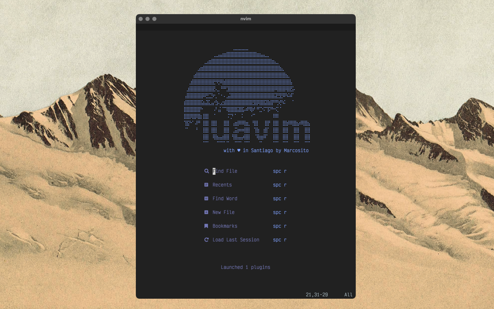

# vim-gasm

Aiming for a full-written in lua neovim configuration, luavim arises.

## Features
* Full set of packs is lazy loaded.
* Less than 30 ms startup time in my M1 Macbook Air.
* +70 configures plugins.
* Using builtin LSP and Treesitter.
* TabNine completion enabled.

## How does it look?

## Testing and usage
This is a very beta stage of the project, hence lot of bugs are expected. 
Here I post some useful comments, I hope:
* I use kitty as my terminal with Victor Mono and Iosevka fonts + Nerdfonts.
* My main machine runs macOS but this was tested in CentOS7 and SCL6 too.
* Neovim version *0.6* was installed via `brew install neovim --HEAD`.
* I try to use as much as possible homebrew binaries.
* This is very related with my other project fictional-couscous. 
